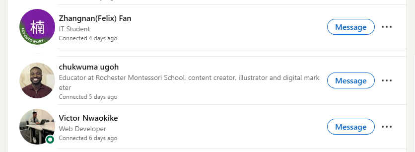
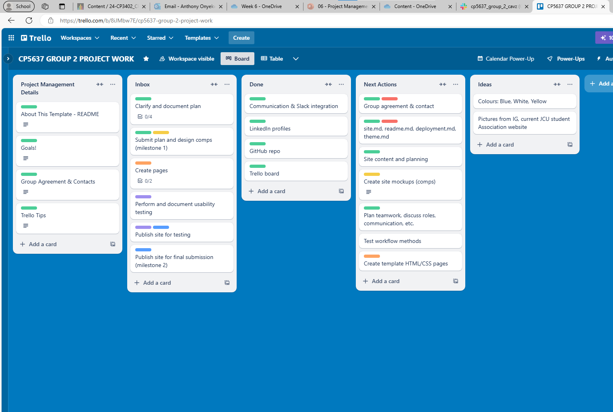
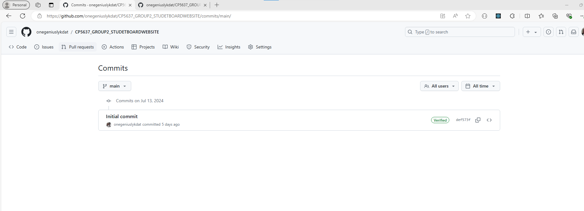

# Week 7
Monday, 15-Jul-2024 to Saturday, 20-Jul-2024

****************************************
Task: Write and run PHP code to demonstrate your understanding of the features/skills below. The content of the page/site is up to you but it must be original and cannot come from some PHP tutorial.

Submit:

Upload your PHP file/s
A link to your learning journal entry
If you like, you can fork The Advice Shop site, get it running, and then update it by making a proper login system and other nice enhancements.

You must demonstrate (at least):

Echo - echoing different kinds of HTML
Decisions - if/else statements
Repetition - for, while, foreach (use an array)
Functions - with parameters
Include - make two (2) pages that include a common header and/or footer using include
DON'T FORGET to do your group work too!!
****************************************

# Learning Activities & Resources***
This week I learnt about project management, specifically, setting up IT based projects and the tools involved. I also learnt about good practices involved in project management. Some of which are:
* Regular communication such as stand-up meetings and the use of instant messaging apps such as Teams and Slack.
* Tasks management with the use of tools like Trello, Azure Board, GitHub Projects amongst others.
* Version control systems such as GitHub and Azure Dev-Ops

Finally, I also liaised with my group members to put into practice some of the things we had learnt.

# Estimated Hours***
I spent a total of about 5 hours of my own time this week on this subject. On Friday, the next day after class, I spent an hour working on setting up my journal. I spent two additional hours on Saturday, the next day, with my group members in order to setup our project and connect on LinkedIn. The following Wednesday, I spent 2 hours working on this journal.

# Content Insights***
This week's content introduced me to the standard ways IT projects are setup and the tools involved. Based on the lesson content, I along with my group members had a meeting on Saturday. During this meeting, we put what we had learnt into practice by:
* Setting up a system for regular communications; we agreed to use [Slack](https://en.wikipedia.org/wiki/Slack_(software)), as well as WhatsApp.
* Setting up our tasks management system, we decided to use [Trello](https://en.wikipedia.org/wiki/Trello) rather than [GitHub Projects](https://docs.github.com/en/issues/planning-and-tracking-with-projects/learning-about-projects/about-projects).
* Setting up our version control system, we created a GitHub repository for our project. 

# Career/Employability/Learning Insights***
This week, I was able to achieve the following as related to employability and career insights:
* Increased my network on LinkedIn by connecting with my group members.

* Get introduced to Trello and see how cards and lists work in a project board by creating a [Trello board](https://trello.com/b/8iJMbw7E/cp5637-group-2-project-work) for our project.

* Integrate key applications such as OneDrive, GitHub and Trello to our [Slack group channel](https://app.slack.com/client/T1HPNSNKT/C078QLM30R4).

* Setup the [GitHub repository](https://github.com/onegeniuslykdat/CP5637_GROUP2_STUDETBOARDWEBSITE) for our project as well as add a ReadMe file in the initial commit. This gave me a good understanding of how repos work. I was also able to connect with my group members and add them as collaborators to the GitHub repo.

I thoroughly enjoyed putting the knowledge gained in class into practice with my group members, as this exposed me to the Trello (which I had not used previously), as well as GitHub collaborations. The meeting with my group members was also very productive, as we completely achieved the setup of our project.
