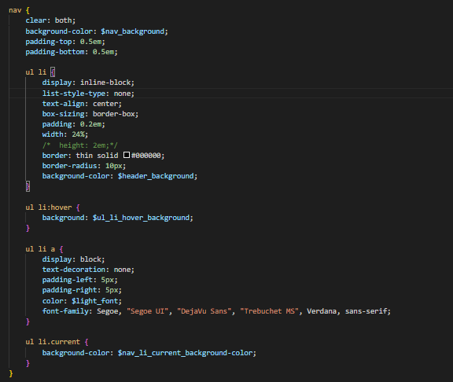
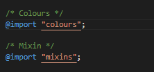
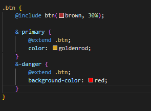
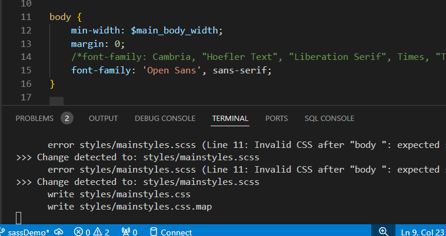

# Week 9
Monday, 29-Jul-2024 to Saturday, 03-Aug-2024

# Learning Activities & Resources
This week I learnt about SASS, which stands for Syntactically Awesome Style Sheets. Sass is a preprocessor scripting language that is interpreted or compiled into Cascading Style Sheets. It allows CSS to use the SOLID principles of software development throught the use of variables and other programming constructs. We were introduced to:
* What SASS is
* How to install SASS
* Using SASs with PHP and NPM
* SASS syntax

I also studied the [LinkedIn Course on SASS](https://www.linkedin.com/learning/sass-essential-training-15630917/) for more knowledge, as I found SASS very interesting.

# Estimated Hours
I spent a total of about 8 hours of my own time this week on this subject. On Saturday, I first had a two hour meeting with my group members. The following week, I spent 2 hours each, on Monday, Wednesday and Thursday working on converting this [php project](https://github.com/onegeniuslykdat/sample-cp5637-theadviceshop)) from using CSS to SASS. Additionally on Thursday, I also completed this journal.

# Content Insights
This week's content introduced SASS. I understood why SASS is very useful, especally for large projects. I was able to install SASS in the php project, and enable the watcher using the npm watch command. Finally, I got introduced to the syntax by using variables, prforming basic arithmetic, creating styles nests and using mixins.

Based on the lesson content, I was able to achieve the following, as seen in this [commit](https://github.com/onegeniuslykdat/sample-cp5637-theadviceshop/commit/05b6cc1aba2ae8635a58f8dc8ea04f3d3e9cc505) created in the [new branch](https://github.com/onegeniuslykdat/sample-cp5637-theadviceshop/tree/sassDemo):
* Create variabes
* Perform simple arithmetic operations
* Use in-built functions, such as darken and adjust-hue
* Create a mixin
* Nest related styles
* Use inheritance
* Extending

# Career/Employability/Learning Insights
This week, I was able to achieve the following as related to employability and career insights:
* Convert the php project from using css to sass, as shown [here](https://github.com/onegeniuslykdat/sample-cp5637-theadviceshop)
* Understand how npm works with css. How it converts the sass input file to a css output file
* Make some modifications; these include creating a variables, using mixins, etc.
* Understand how npm tracks automatically tracks changes in the sass file; using the command: *sass --watch  styles/mainstyles.scss:styles/mainstyles.cs*.

I thoroughly enjoyed working with SASS. It really simplified the CSS file. The syntax is also similar to regular CSS and Javascript, so creating variables and mixins was pretty easy. Overall, this new skill would really enhance my professional career. I can say that I now have a very good understanding of SASS.
