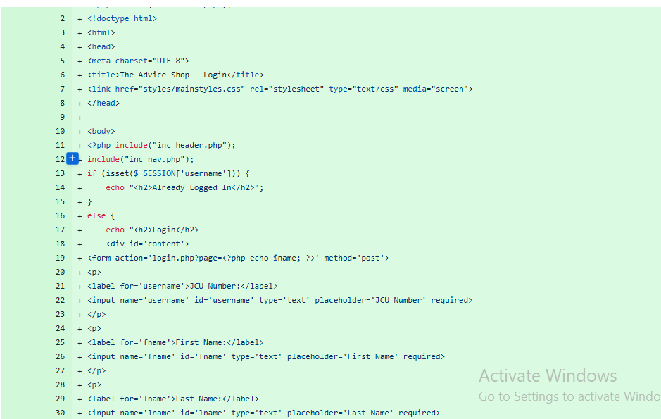
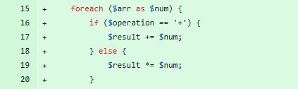
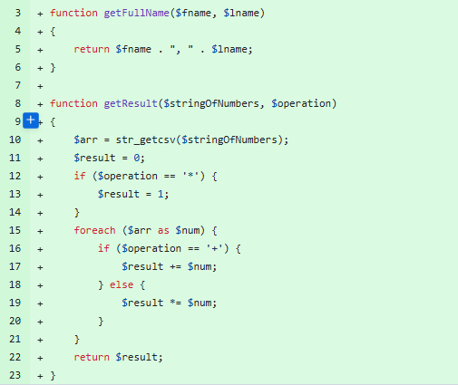
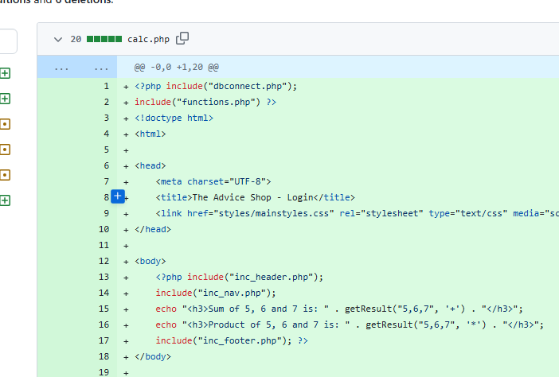

# Week 9
Monday, 29-Jul-2024 to Saturday, 03-Aug-2024

************************************************
You must demonstrate (at least):
sass with node
variables
nesting
mixins
extend/inheritance
************************************************

# Learning Activities & Resources***
This week I learnt about SASS, which stands for Syntactically Awesome Style Sheets. Sass is a preprocessor scripting language that is interpreted or compiled into Cascading Style Sheets. It allows CSS to use the SOLID principles of software development throught the use of variables and other programming constructs. We were introduced to:***
* What SASS is
* How to install SASS
* Using SASs with PHP and NPM
* SASS sytax

# Estimated Hours
I spent a total of about 8 hours of my own time this week on this subject. On Saturday, I first had a two hour meeting with my group members and then I did about an hour of study on SASS. The following week, I spent 2 hours each, on Monday and Wednesday working on converting this [php project](https://github.com/onegeniuslykdat/sample-cp5637-theadviceshop)) from using CSS to SASS. Finally on Thursday, I spent an hour working on this journal.

# Content Insights
This week's content introduced SASS. I understood why SASS is very useful, especally for large projects. I was able to install SASS in the php project, and enable the watcher using the npm watch command. Finally, I got introduced to the syntax by using variables, creating styles nests and using mixins.

***
This week's content introduced me to PHP. Based on the lesson content, I was able to achieve the following, as seen in this [commit](https://github.com/onegeniuslykdat/sample-cp5637-theadviceshop/commit/c585fd0f92746c295e71962c48bb3af31733d84c):
* Use the echo function to display different HTML elements

* Use if/else for decisions statements
 

* Use foreach loop on an array to show repitition

* Create and call functions with parameters

* Make use of the include function to add the common header and footer onto the two new pages that I created

***

# Career/Employability/Learning Insights***
This week, I was able to achieve the following as related to employability and career insights:
* Convert the php project from using css to sass, as shown [here](https://github.com/onegeniuslykdat/sample-cp5637-theadviceshop)
* Understand how npm works with css. How it converts the sass input file to a css output file
* Make some modifications; these include creating a variables, misins, etc.

***I found setting up and getting started with PHP very simple. The syntax of php, however, seems a bit tricky with the '<?php ?>' tag in the html files. Overall,, I thoroughly enjoyed putting the knowledge gained in class into practice in my php project and I can say that I now have a fair understanding how to create a simple php website. The meeting with my group members was also very productive, as we completely achieved our goal to divide the tasks required, based on the content provided.

***************** FROM WEEK 7 ****************************
# Week 7
Monday, 15-Jul-2024 to Saturday, 20-Jul-2024

# Learning Activities & Resources
This week I learnt about fundamentals of PHP. We were introduced to:
* How PHP works,
* Some of the keywords in PHP,
* PHP file/folder structure and
* Database in PHP using sqlite

I also liaised with my group members on how best to go about our project, and how to divide the tasks.

# Estimated Hours
I spent a total of about 6 hours of my own time this week on this subject. On Friday, the next day after class, I spent an hour working on setting up my journal and practising some PHP. I spent two additional hours on Saturday, the next day, with my group members in order to continue with our project tasks, by dividing out the works and getting more familiar with GitHub. The following Wednesday, I spent 3 hours working on my PHP project and completing this journal.

# Content Insights
This week's content introduced me to PHP. Based on the lesson content, I was able to achieve the following, as seen in this [commit](https://github.com/onegeniuslykdat/sample-cp5637-theadviceshop/commit/c585fd0f92746c295e71962c48bb3af31733d84c):
* Use the echo function to display different HTML elements

* Use if/else for decisions statements
 

* Use foreach loop on an array to show repitition

* Create and call functions with parameters

* Make use of the include function to add the common header and footer onto the two new pages that I created

For our group work, I along with my group members had a meeting on Saturday. During this meeting, we put what we had learnt into practice by:
* Dividing our tasks, as seen on our [Trello Board](https://trello.com/b/8iJMbw7E/cp5637-group-2-project-work)
* Setting up our version control system, we structured our project GitHub repository, with each of us having a branch. We then created [Pull Requests (PR)s](https://github.com/onegeniuslykdat/CP5637_GROUP2_STUDETBOARDWEBSITE/pulls?q=is%3Apr+is%3Aclosed) in order to merge the changes for our site.md, theme.md, readme.md and deployment.md files.

# Career/Employability/Learning Insights
This week, I was able to achieve the following as related to employability and career insights:
* Create my own fork of the PHP Github repo, as seen [here](https://github.com/onegeniuslykdat/sample-cp5637-theadviceshop)
* Clone the repo onto my local PC
* Make some modifications; these include creating a separate and more improved login page, creating two functions, redesigning the header and footer sections
* Commit my changes to my PC and push to my online fork

I found setting up and getting started with PHP very simple. The syntax of php, however, seems a bit tricky with the '<?php ?>' tag in the html files. Overall,, I thoroughly enjoyed putting the knowledge gained in class into practice in my php project and I can say that I now have a fair understanding how to create a simple php website. The meeting with my group members was also very productive, as we completely achieved our goal to divide the tasks required, based on the content provided.
